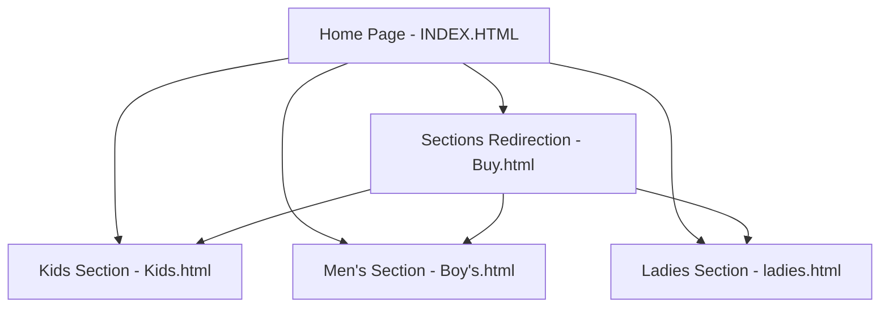

# PROJECT PROPOSAL: ONLINE CLOTHING STORE (BRAINY STYLES)

---

## 1. PROJECT OVERVIEW
**Brainy Styles** is a contemporary retail boutique located at Kotuwegoda, Matara, Sri Lanka. The goal of this project is to design and develop a responsive, user-friendly, and modern front-end web application for the boutique. The website serves as a digital showroom, enabling local customers to explore apparel collections across three main categories: Ladies, Men, and Kids. By providing a clean interface with clear pricing and store details, the platform bridges the gap between digital browsing and in-store purchasing.

---

## 2. PROJECT OBJECTIVES
* **Digital Presence:** Establish a professional online storefront for Brainy Styles.
* **Categorical Browsing:** Organize products into distinct sections (Kids, Men, Ladies) to streamline the shopping experience.
* **Responsive Design:** Implement a mobile-first, responsive design that works seamlessly on smartphones, tablets, and desktop computers.
* **Enhanced User Experience (UX):** Use smooth transitions and modern card layouts to present products clearly.
* **Offline Conversion:** Provide clear store details (location, operating hours, contact numbers) to encourage physical visits.

---

## 3. TARGET AUDIENCE
* **Local Shoppers in Matara:** Customers seeking convenient browsing of local boutique stock.
* **Parents:** Looking for kids' clothes with quick navigation.
* **Fashion-Conscious Adults:** Men and women seeking casual and stylish clothing options.

---

## 4. SYSTEM ARCHITECTURE & SITEMAP
The web application is structured as a multi-page static site:

### Page Breakdown:
1. **Home Page (`INDEX.HTML`):** Features the brand name, store summary, operating hours, address, and interactive call-to-action buttons.
2. **Sections Page (`Buy.html`):** A portal displaying summaries of the available fashion departments with links to individual pages.
3. **Kids Section (`Kids.html`):** Product catalog showcasing children's wear.
4. **Men's Section (`Boy's.html`):** Product catalog showcasing men's wear.
5. **Ladies Section (`ladies.html`):** Product catalog showcasing ladies' wear.

---

## 5. DESIGN & AESTHETICS
* **Color Palette:** Professional gradient transitions (Royal Blue to Soft Violet), white backgrounds for content clarity, and neutral light-grey sections.
* **Typography:** `Plus Jakarta Sans` from Google Fonts to convey a premium, clean look.
* **Interactive Elements:** Micro-animations (e.g., box-shadow glow transitions on buttons, smooth page fade-in transitions).
* **Card layouts:** Modern rounded-corner shadow cards with product details on the left and high-quality images on the right.

---

## 6. TECHNOLOGY STACK
* **HyperText Markup Language (HTML5):** Semantic tags for structure.
* **Cascading Style Sheets (CSS3):** Custom styles, including `master.css` for page transitions and button glow animations.
* **Bootstrap 5 Framework:** Responsiveness, navigation, layout grids, and utility classes.
* **Bootstrap Icons:** Vector iconography for modern visual aids.

---

## 7. KEY FEATURES & FUNCTIONALITY
* **Dynamic Page Transitions:** Custom CSS keyframes create a smooth fade-in and slide-up effect upon load.
* **Responsive Navigation Bar:** Collapsible burger menu on smaller screens.
* **Clear Product Details:** Cards containing high-resolution product images, descriptive names, and local currency prices (LKR).
* **Location & Hours Widget:** Dedicated section on the home page highlighting operational details for the Matara branch.

---

## 8. FUTURE IMPROVEMENTS
* **Dynamic Database Integration:** Implement a backend (Node.js/Express with MongoDB or PHP with MySQL) to load products dynamically rather than hardcoding.
* **Shopping Cart & Checkout:** Implement a client-side cart system (using LocalStorage) and integrate a local payment gateway (e.g., Payhere, Stripe).
* **User Authentication:** Allow customers to create profiles, save favorites, and track past purchases.
* **Admin Dashboard:** Provide store owners with an interface to add, edit, or delete items and track orders.

---

## 9. CONCLUSION
The **Brainy Styles** website proposal details a practical, clean, and responsive front-end design that meets the requirements of a modern web programming assignment. It highlights the store's products, details, and branding in an appealing manner, ensuring a solid foundation for future e-commerce capabilities.
